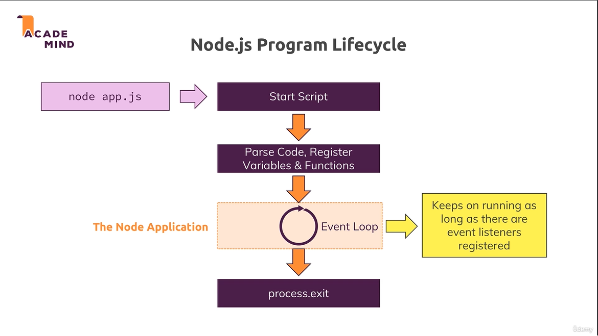
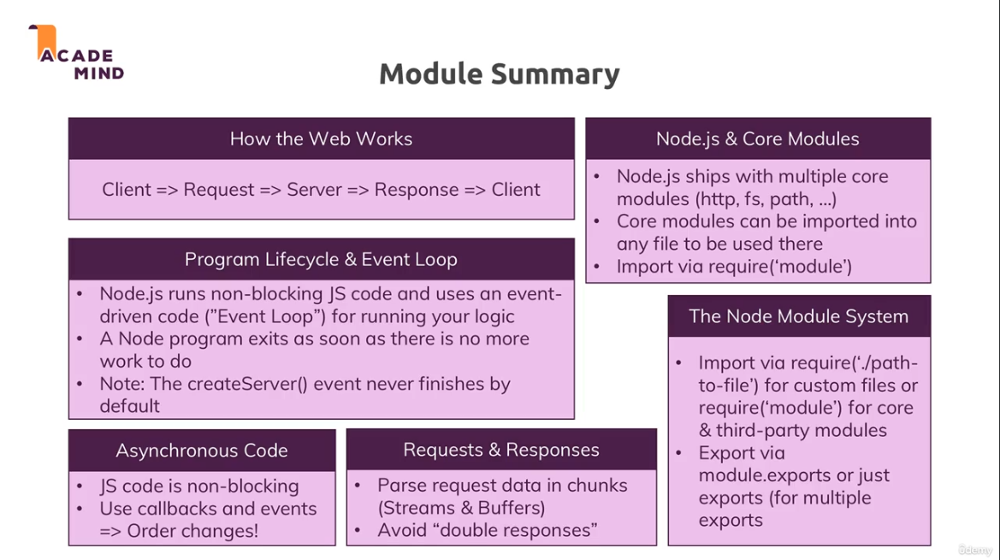

[<<-- back to main](../../README.md) - [next section -->](../section%204%20development%20workflow%20and%20debugging/section4-notes.md)

# Section 3 - understanding the basics

1. some core modules available in node.js are http,https,fs,path,os
2. these modules are not globally available, hence we need to import with require()
3. if we write res.write() after res.end() it will result in error
4. fs.writeFileSync() is blocking sync code and fs.writeFile() is non-blocking async code

# streams and buffers

# nodejs life cycle

# single thread, event loop and blocking code

# event loop

# module summary

# DIY router
1. https://hackernoon.com/understanding-express-js-creating-your-own-node-http-request-router-4190a9b6aad6

# Useful resources:
1. Official Node.js Docs: https://nodejs.org/en/docs/guides/
2. Full Node.js Reference (for all core modules): https://nodejs.org/dist/latest/docs/api/
3. More about the Node.js Event Loop: https://nodejs.org/en/docs/guides/event-loop-timers-and-nexttick/
4. Blocking and Non-Blocking Code: https://nodejs.org/en/docs/guides/dont-block-the-event-loop/

[<<-- back to main](../../README.md) - [next section -->](../section%204%20development%20workflow%20and%20debugging/section4-notes.md)
